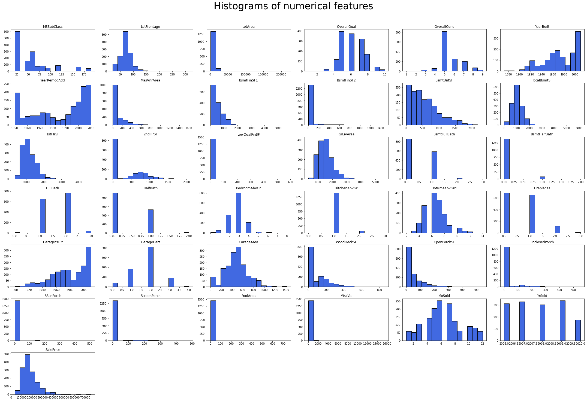
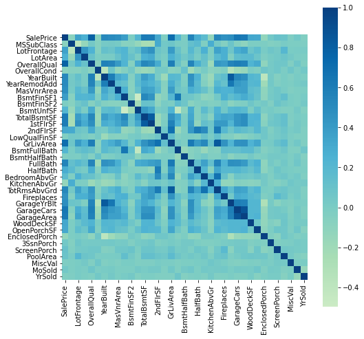
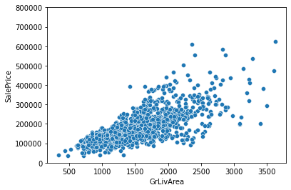
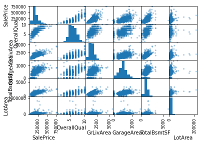
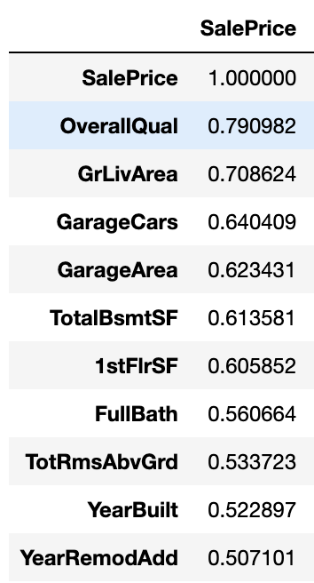
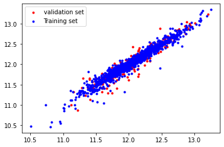
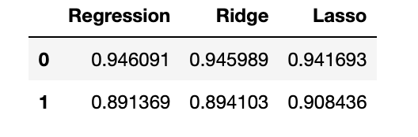

# Case study: Feature Engineering - Ames house price prediction 

## 1 Problem statement 

In this case study, you will prepare Ames Housing Dataset in a csv file in a way that it is suitable for a ML algorithm. 
You will achieve this by first exploring the data and performing feature transformations on provided dataset of house price prediction ML problem. You are required to train a ML model by using linear regression, ridge regression and lasso regression 
for predicting house prices.

## 2 Steps 
### 2.1 Load data set 
### 2.2 Exploratory Data Analysis (EDA)
#### 2.2.1 Histograms 

#### 2.2.2 Heatmap

#### 2.2.3 Scatterplots 

#### 2.2.4 Scatter matrix 

#### 2.2.5 Correlation between other features and 'SalePrice'

The target 'SalePrice' variable is highly correlated with features such as OverallQual, GrLivArea, GarageCars, GarageArea and TotalBsmtSF among others.

### 2.3 Process dataset for ML 

* Handle missing values 
 * 1. Fill nulls for 'LotFrontage' with median value calculated after grouping by 'Neighborhood'
 * 2. Fill nulls for 'GarageYrBlt','MasVnrArea' with 0
* Apply log-transform on target feature 'SalePrice'
* One-hot encoding

## 3 Linear Regression 
Split dataset in training set (X_train, y_train) and test set (X_test, y_test)

## 4 Evaluate model 
- R^2 score on trainig set: 0.94609
- MSE score on trainig set: 0.00808
- R^2 score on test set: 0.89136
- MSE score on test set: 0.01472

## 4 Model refinement 
### 4.1 ridge regression 

### 4.2 lasso regression 

## 5 Conslusion 

